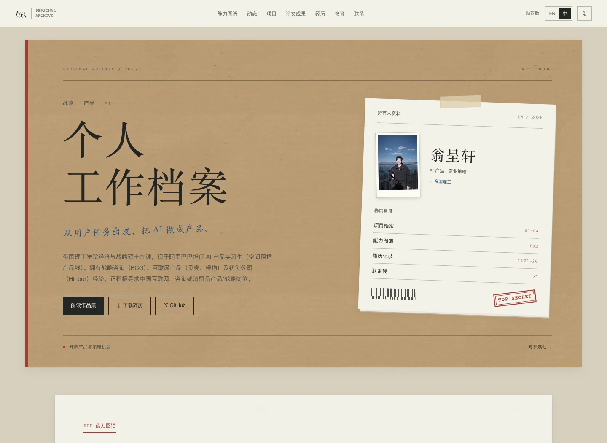
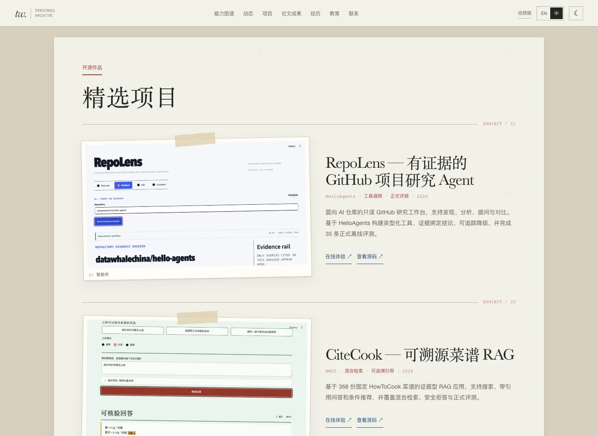

# 个人主页 · 档案袋风格审阅稿

审阅地址：[中文版](https://teemo-dossier-review.vercel.app/?lang=zh) · [English](https://teemo-dossier-review.vercel.app/?lang=en)

本稿在 `codex/dossier-homepage-20260907` 分支制作，基于主分支 `15c5cda`。正式 GitHub Pages 继续由 `main` 发布；需要审阅确认后再合并。本次不修改 `v1/` 与 `v2/`。

## 视觉方向

沿用 AI 产品作品集的档案袋语言：牛皮纸封套、旧白纸资料页、红色装订边、蓝色手记、胶带、证件照与档案章。首页是个人工作档案的封面，四个项目使用大幅截图与项目说明组成证据页；经历与教育以档案记录排列。

颜色：牛皮纸 `#C4AB86`、纸张 `#F3F1E9`、墨色 `#242622`、蓝墨 `#274E77`、红章 `#A13C32`。标题使用 Baskerville / 宋体，正文使用系统无衬线字体，免去外部字体请求。纸纹来自同款作品集，并压缩为 WebP。

新增 [PDF 作品集入口](../uploads/archive/ai-portfolio-dossier.pdf)。项目与经历事实沿用原站内容，补齐中英文区块标题，并说明联系表单会打开邮件客户端。

## 审阅重点

- 首屏是否符合预期的档案封套感觉，文字大小和照片比例是否合适。
- 项目截图与说明是否便于快速浏览。
- 手机端的纸张层次、中英文排版，以及深色主题是否舒服。





## 验证

保留中英文切换、主题记忆、独立能力卡翻页、简历下载、真实 GitHub 仓库读取与直接联系链接。移除粒子和打字动画；没有 JavaScript、浏览器存储不可用以及系统减少动效时，正文仍可阅读。GitHub 弹窗支持键盘焦点循环、Esc 关闭及焦点返回。

在安装了 Playwright 与 Chromium 的环境中运行：

```sh
python3 -m unittest discover -s tests -p 'test_*.py'
node tests/test_capability_map.mjs
node tests/test_dossier_homepage.mjs
```

`CHROME_PATH` 可指定本机 Chrome；`BASE_URL` 可指定在线审阅站；`LIVE_GITHUB=1` 可额外验证真实 API。测试中的固定响应仅用于回归测试，页面继续请求真实 GitHub 数据。

页面保持单个 HTML，CSS / JS 内联，无需构建。审阅站是单独的 Vercel 项目，未连接正式主页域名。
